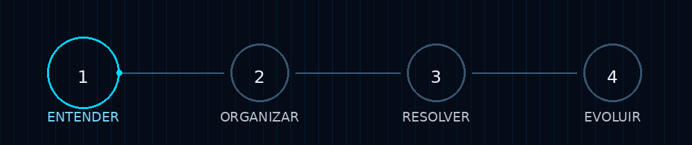

 

---

## 👋 O problema vem antes da ferramenta

Pequenos negócios não costumam precisar de **mais uma ferramenta**.

Muitas vezes precisam de:

**menos improviso · atendimento mais claro · processos simples · informação organizada**

> **Eu ajudo pequenos negócios a organizar a operação e simplificar o dia a dia.**

---

## 🧭 Como eu penso

**1. Entender** o que está travando.  
**2. Organizar** o que está espalhado.  
**3. Resolver** o que realmente precisa ser resolvido.  
**4. Evoluir** sem criar complexidade desnecessária.

**A solução depende do problema.**

---

## 🏢 DR9 Gestão

**Diagnóstico • Organização • Soluções**

A DR9 Gestão é o projeto que estou construindo para transformar problemas do dia a dia em **processos mais claros e soluções que façam sentido**.

**Gestão + Processos + Tecnologia.**

Tecnologia entra como meio — não como ponto de partida.

---

## ⚙️ O que eu construo

`Atendimento` · `Processos` · `Automação` · `Integrações` · `Sistemas` · `Infraestrutura`

E estudo ferramentas como:

---

## 🚀 O que este perfil mostra

Não é um portfólio de coisas prontas.

É o registro de alguém que está:

**aprendendo → testando → construindo → melhorando**

Tecnologia, aqui, é uma ferramenta para resolver problemas reais.

---

## 🤝 Dois caminhos

### 👋 Conhecer o Daniel
Conteúdos, ideias, aprendizados e bastidores de quem está construindo.

**[Instagram](https://www.instagram.com/romeiroceo/) · [LinkedIn](https://www.linkedin.com/in/daniel-romeiro-9bb747418/) · [YouTube](https://www.youtube.com/@DevDR9) · [TikTok](https://www.tiktok.com/@romeiroceo)**

### 🏢 Conhecer a DR9 Gestão
Soluções para pequenos negócios que precisam de mais organização na operação.

**[Instagram @gestaodr9](https://www.instagram.com/gestaodr9/)**

---

